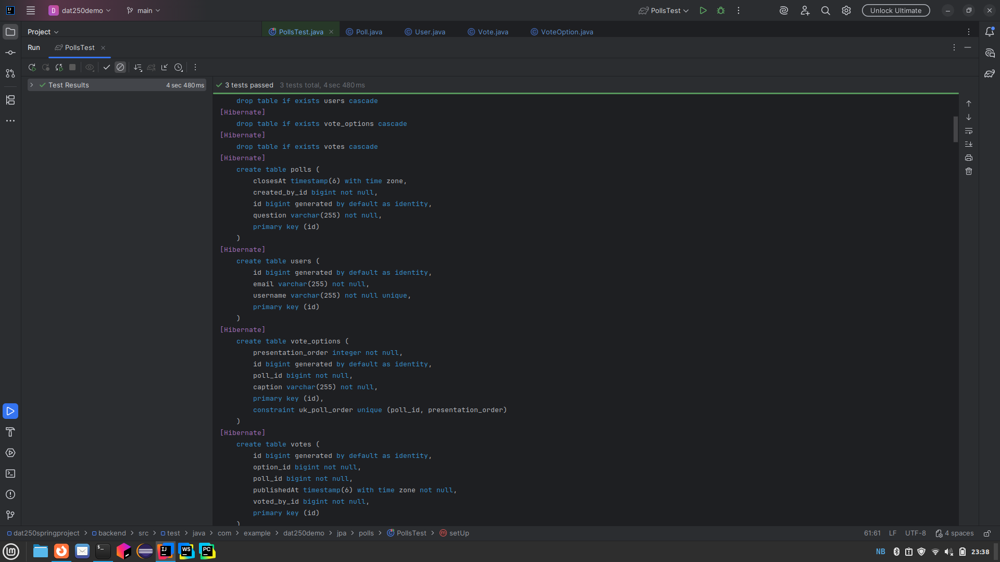
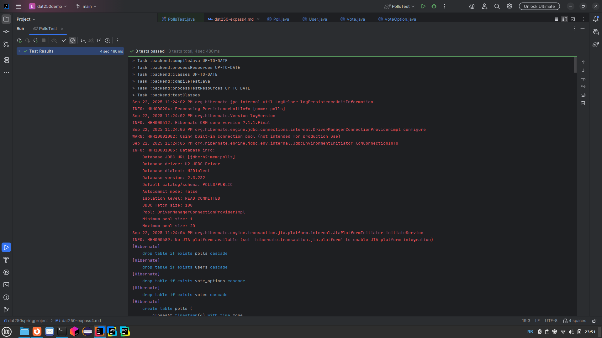

# Software Technology Experiment 4: SPA

The goal of this assignment was to use put JPA annotation into the domain models, 
turning them into entities and run the PollsTest to check that persistence worked.

### What was done
- copied the domains created from before
- changed some of the code and added JPA annotations
to match the PollsTest
- added dependecies mentioned in the assignment, and removed spring-dependencies.

### Troubles
- Had a lot of problem getting running the test with error messages about
gradle worker. After a lot of troubleshooting with the help og google and chatGPT, 
the only answer I got was there could be a problem with gradle and windows.
In the end i switched to a linux machine and finally got the test to run.
despite a sea of red, the tests passed, and i managed to print out something.

### Pending
- Have not created a database yet, due to time running out.